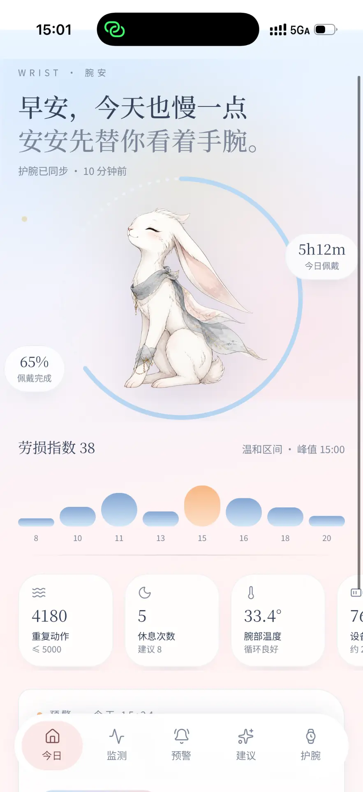
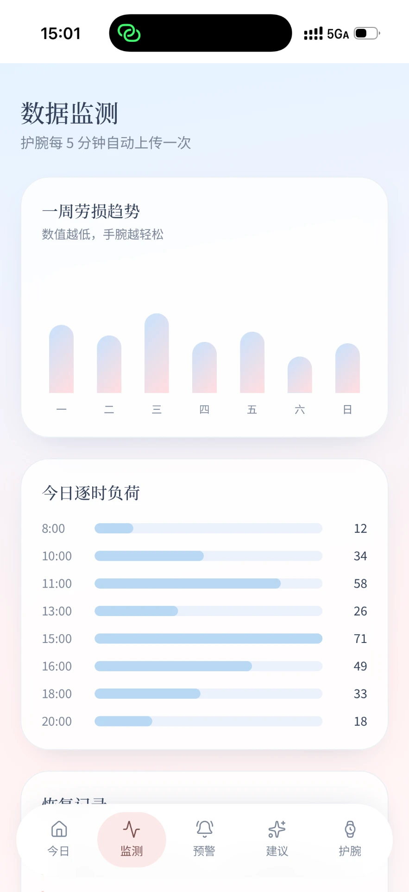
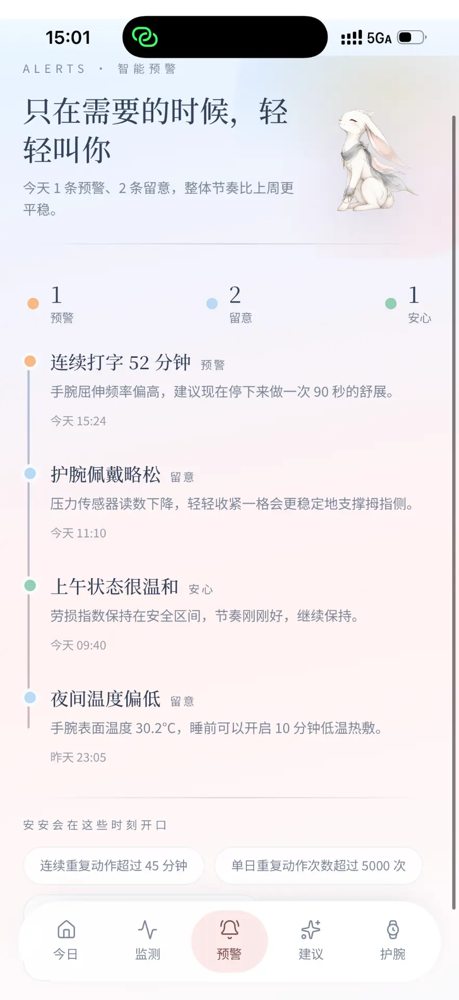
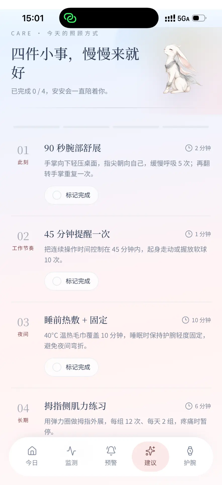
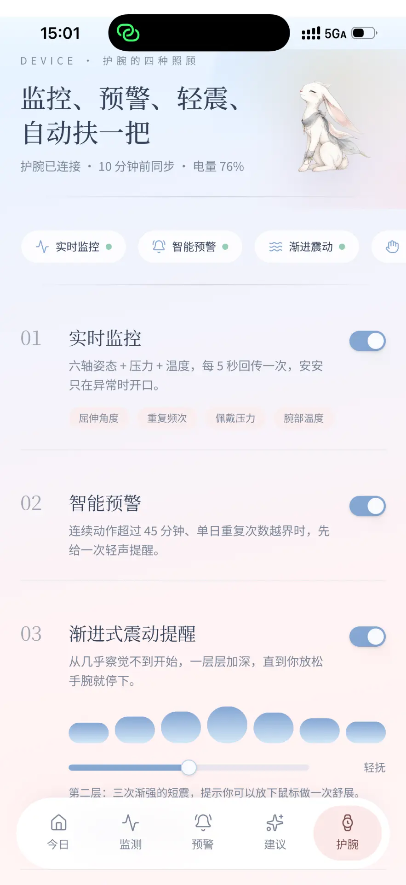
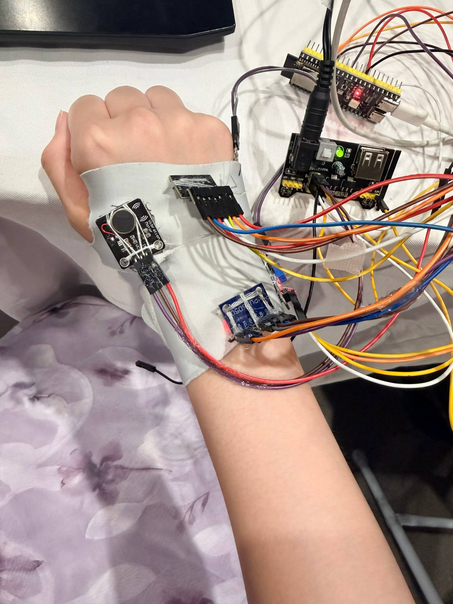

# 腕安 · 智能腕部姿势提醒护腕

腕安是一款面向长时间使用键盘和鼠标人群的智能腕部姿势提醒护腕。产品在手背与前臂各放置一块惯性测量单元（IMU），通过两者的相对姿态计算腕关节的屈伸角与尺桡偏角，结合连续使用时间与护腕内单点压力信号，在腕部偏离中立位持续过久时，先以马达轻震提醒，若未回正再通过软件弹窗给出具体调整建议，并记录提醒次数与提醒后的回正情况。

## 产品为谁服务

每天连续使用鼠标与键盘数小时的办公女性人群：程序员、设计师、财务、学生与内容创作者；尤其是已出现轻度腕部疲劳、希望改善工作习惯但无法减少工作量的女性。

## 解决什么问题

专注工作时，人对自己腕部姿势几乎没有感知；普通护腕只能提供被动支撑，不知道佩戴期间姿势是否改善；定时休息软件只知道「用了多久」，不知道手腕当时怎么放。腕安弥补的正是「姿势 + 时长 + 反馈 + 记录」这一段竞品缺失的部分。

## 当前样机已经实现什么

- 双 IMU 相对角度解算与 5 秒中立位校准
- 单点压力原始值读取
- 连续使用时长统计
- 基于角度阈值与持续时间的提醒规则
- 马达震动与网页弹窗联动
- 提醒事件与回正情况记录
- 数据 CSV 导出
- 通过网站进行实时监测和分析，并提供对应的缓解方案（内置视频）

当前为有线工程样机（USB 供电、串口通信），无线化方案已完成设计但尚未装机。计划未来加入热敷和气囊支撑功能。

## 项目链接

**在线体验**: https://gentle-wrist-care.lovable.app

## 界面预览

| 今日 | 数据监测 | 智能预警 |
| --- | --- | --- |
|  |  |  |

| 照顾建议 | 护腕能力 |
| --- | --- |
|  |  |

### 工程样机




## 本地开发

```sh
git clone https://github.com/Debra2559/gentle-wrist-care.git
cd gentle-wrist-care
npm i
npm run dev
```

## algorithm/ —— SheWrist 腕部暴露算法后端

`algorithm/` 目录来自 [lxy2137/algorithm_for_predict](https://github.com/lxy2137/algorithm_for_predict)，是 Python 实现的离线分析与后端 API（腕角估计、暴露剂量、阈值状态机、影子 ML 与解释服务）。

本地启动：

```bash
cd algorithm
python3 -m pip install -r requirements.txt -r requirements-api.txt
PYTHONPATH=src python3 scripts/run_api.py --host 127.0.0.1 --port 8000
```

前端通过服务端环境变量对接（见 `src/lib/shewrist.functions.ts`）：

- `SHEWRIST_API_BASE_URL`：例如 `http://127.0.0.1:8000`
- `SHEWRIST_API_TOKEN`：可选 Bearer 令牌

未配置时「报告」页自动回退到结构一致的演示数据。接口规范见 `algorithm/docs/backend_api.md`。

## 硬件数据对接

硬件样机可通过 `POST /api/public/ingest` 批量上报采样数据，写入后端数据库后，报告页每 5 秒自动轮询刷新。详细字段与联调示例见 `docs/硬件数据对接说明.md`。
