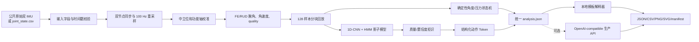

# SheWrist 纯离线算法 v0.8

日期：2026-08-28

## 当前结论

纯离线算法已形成单命令闭环：公开原始双 IMU 或标准 `joint_state.csv` 输入，经同步、质量检查、校准、腕角计算、确定性暴露状态机、CNN-HMM 影子识别、Token、解释适配器和审计报告后，输出 JSON、CSV、PNG 与 SVG。

当前不接目标硬件。所有结果均属于公开数据回放或明确标记的模拟故障，不构成目标硬件、人体有效性或医学证据。

## 一条命令

```bash
PYTHONPATH=src MPLCONFIGDIR=.cache/matplotlib python3 scripts/run_offline_session.py \
  --public-subject subject01 \
  --session-id public-subject01-offline-v08 \
  --evidence-type replay \
  --output-dir outputs/offline_session
```

默认解释器是本地模板，不发起网络请求。实际基线产物中：

```text
explanation.provider = local_template
explanation.model = shewrist-template-v1
explanation.api_called = false
control_policy.llm_control_authority = none
```

## 端到端流程



权限固定如下：

```text
确定性状态机 -> 提醒、压力停止、人工机械建议
CNN-HMM      -> 动作标签、置信度、Token；control=none
解释适配器   -> 非临床工程摘要；control=none
```

## 当前实际验收

`subject01/set2` 原始双 IMU 回放结果：

- 输入 `11,340` 个样本，按 `128` 样本分成 `89` 个块。
- 有效样本率 `99.08%`。
- CNN-HMM 共输出 `224` 个窗口，接受 `128` 个、拒识 `96` 个。
- 合并得到 `6` 个影子动作 Token。
- 分块摄取重建与原输入完全一致。
- 确定性状态机逐样本结果与单批运行完全一致。
- 最终分析 JSON 指纹完全一致。
- 外部 LLM/API 调用为 `false`。

流式语义需准确理解：确定性状态机真正跨块保持状态；CNN-HMM 当前在完整会话缓冲结束后统一 finalize，不声称已经实现因果实时 HMM。

## 故障矩阵

软件级故障套件共 9 个场景：基线、丢包、乱序、50 ms 双节点时移、传感器静默、饱和、陀螺零偏、安装旋转和渐进滑移。

已验证行为：

- 乱序时间戳在推理前明确拒绝。
- 50 ms 节点时移超过 `20 ms` 门槛，整段质量置零，ML 全部拒识。
- 丢包区间被标记为源时间戳缺口并降低有效样本率。
- 静默与饱和可被原始传感器质量门控标记。
- 所有已完成场景的批处理与分块输出一致。
- 所有场景中 ML 和解释器控制权限均为 `none`。

陀螺零偏、刚性安装旋转和渐进滑移目前只完成敏感性测试。没有独立角度真值、安装元数据或目标硬件冗余时，算法不能可靠区分它们与真实运动，因此不得声称已经在线检测或补偿。

## 有限模型选择

只使用 `subject01–subject09` 训练、`subject10` 验证来比较：

- 池化：`mean / mean_max`。
- 置信度门槛：`0.45 / 0.55 / 0.65`。
- HMM 自转移先验：`10 / 20 / 40`。

锁定配置后才读取 `subject11` 一次。当前候选为：

```json
{
  "pooling": "mean",
  "confidence_threshold": 0.55,
  "hmm_self_transition_prior": 10.0
}
```

该候选的验证拒识后 macro-F1 为 `0.766`、覆盖率 `84.94%`；锁定测试 macro-F1 为 `0.790`、覆盖率 `72.73%`。这只是一次锁定拆分的工程比较，不替代嵌套交叉验证，也不会自动覆盖现有全量公开数据模型。

## LLM/API 替换接口

当前算法主链不调用 LLM。解释层采用稳定的 `ExplanationRequest` / `ExplanationResponse` 字段契约，默认 provider 为 `template`。

要接入生产或应用 API，只需把 `config/explanation_api.json` 中 provider 改为 `openai_compatible`，并设置：

```bash
export SHEWRIST_LLM_ENDPOINT="https://your-service.example/v1/chat/completions"
export SHEWRIST_LLM_API_KEY="..."
export SHEWRIST_LLM_MODEL="your-production-model"
```

随后显式运行：

```bash
PYTHONPATH=src python3 scripts/run_offline_session.py \
  --explanation-provider openai_compatible \
  --enable-external-api
```

发送内容只包含经过筛选的暴露指标、提醒计数、动作 Token、质量与证据类型，不发送原始 IMU 样本。API 响应必须通过结构校验，且 `safety_effect` 必须为 `none`；任何企图声明报警或机械权限的响应都会被拒绝。

## 产物

```text
outputs/offline_session/
├── analysis.json       双分支结果、回放一致性和解释请求/响应
├── joint_state.csv     标准化腕部状态
├── timeline.csv        腕角、质量、动作、提醒逐样本时间轴
├── tokens.json         影子动作 Token
├── session_report.png  会话图表
├── session_report.svg  可缩放会话图表
└── manifest.json       输入、配置、模型、输出 SHA-256 和权限清单

outputs/fault_suite/
├── fault_matrix.csv
└── fault_report.json

outputs/model_selection/
├── activity_cnn_hmm_locked_split.npz
├── selected_ml_activity.json
└── selection_report.json
```

## 剩余边界

离线 v0.8 已可演示和复现，但以下内容仍未建立：目标硬件时间同步、独立角度真值 MAE、FSR/张力/快速释放台架、可靠滑移检测、跨会话重戴数据，以及人体舒适度、效果或疾病风险证据。硬件接入继续暂缓，待离线版本评审后再启动。
