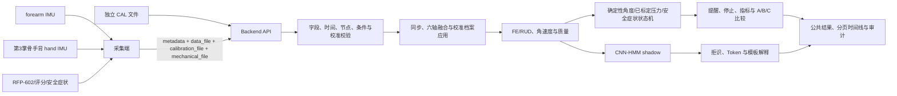

# SheWrist 项目状态与算法—后端联调契约

日期：2026-08-29
当前版本：纯离线算法 `v0.8`，Backend API `v1.0`

## 1. 权威口径

当前工程实现以 `SheWrist_实现方案_医学指标与硬件软件.docx` 为总体基线，并由最新版 `SheWrist_现场采集协作与传感器安装手册2026-08-28.docx` 覆盖安装位置、采集字段、校准流程和 A/B/C 条件中的冲突内容。`SheWrist 今日进展与待办交接` 冻结 2026-08-29 的实物与实采状态；轻量化无线化文档用于后续单 Hub、BLE、定制 PCB 和软件联动路线，不把目标尺寸、续航或丢包率写成已实现。

本文件已替换此前的虎口安装、五段同文件校准、三点压力主模板、旧 A/B/C 和 `7/10` 舒适度口径。旧结果只在 `docs/validation_report.md` 的历史审计节保留。

## 2. 一句话结论

SheWrist 已有有线原型完成“双 IMU + 单点 RFP-602 → 原始 CSV”的连续采集，软件侧已打通“标准双 IMU + 独立 CAL + 可选 RFP/安全状态 → 同步与姿态 → 腕角 → 确定性暴露/提醒 → CNN-HMM 影子分支 → API、时间线和审计产物”的纯离线闭环。

新增实采适配器已将 13 份原始 CSV 全部转换为当前后端可解析的标准格式，但这些文件没有参与者、A/B/C、任务或 CAL 身份，也没有独立 CAL 和外部角度真值。因此当前能证明的是有线数据链路与格式适配已跑通，不能据此宣称目标硬件角度精度、支撑/提醒效果或医学有效性。

## 3. 2026-08-29 有线实采状态

| 项目 | 核验结果 | 当前用途 |
| --- | --- | --- |
| 原始采集 | 13 份；259,755 个双节点采样时刻；累计约 726.2 s | 数据链路、解析兼容、故障测试 |
| 角度旧输出 | 2 份；600 行；累计约 119.6 s | 仅诊断审计，不提升为正式 `joint_state` |
| 采样率 | 1 份 5 Hz；其余约 369–405 Hz | 保留原采样，不插值、不降采样；正式协议需统一并记录 |
| 时间质量 | 3 份存在时间缺口 | 缺口后样本标记 `quality=0` 并写入审计 |
| 传感器质量 | `225224` 含 6,563 个前臂加速度全零样本 | 标记无效，不作为正常运动证据 |
| RFP-602 | 12/13 份多数样本达到 4095 | 只保留 ADC；不能比较支撑效果或换算 N/kPa |
| RUD | 第一份旧角度输出有 10 次跨 ±180° 跳变；第二份绝对值也超过 90° | 需静态真值、轴映射、展开与 CAL 修正 |
| 身份/条件 | 无参与者、A/B/C、任务、CAL 和提醒事件 | 不能做条件效果或提醒响应比较 |

导入命令：

```bash
.venv/bin/python scripts/import_hardware_captures.py \
  --source-dir datasets \
  --output-dir outputs/hardware_capture_import
```

原始 `datasets/` 被 Git 忽略并只读使用；标准化副本和 `audit_report.json` 写入 `outputs/hardware_capture_import/`。适配器执行 `device_us → device_ms`、`g → m/s²`、`deg/s → rad/s`、`arm → forearm` 和原始 ADC 字段映射，同时保存源文件 SHA-256。它不绕过 API 的独立 CAL 与身份门控。

## 4. 目标硬件契约

| 组件 | 位置 | API 映射 | 当前输出 |
| --- | --- | --- | --- |
| IMU-A | 腕关节线向肘部约 5 cm，允许 4–6 cm，前臂背侧中线 | `forearm` + `right/left_distal_forearm` | `q_forearm` |
| IMU-B | 距腕关节线约 2–3 cm，手背第 3 掌骨中段 | `hand` + `right/left_hand_third_metacarpal_dorsum` | `q_hand` |
| RFP-602 | 护腕内层，腕关节线向肘部约 1–2 cm，腕背中央 | `fsr_raw_adc` 或 `fsr_normalized_pct` | 未标定接触载荷代理量 |

两颗 IMU 必须同侧、轴向一致、声明 `coordinate_frame=sensor_local`。腕部相对姿态固定为：

```text
q_rel = inverse(q_forearm) × q_hand
```

软件能验证元数据枚举和同侧关系，不能从数据字符串证明物理安装正确。角度精度、重戴、滑移、皮肤软组织伪影和跨轴串扰仍需目标硬件真值验证。

## 5. 系统全貌



## 6. 独立 CAL

现场原始 A/B/C 会话必须上传独立 `calibration_file`。元数据中的 CAL 区间属于该文件：

```text
neutral            必需
flexion            必需
extension          必需
ulnar_deviation    必需
radial_deviation   可选
```

最新版现场流程包含约 5 秒中立位，以及中立、约 20° 背伸、约 20° 掌屈和约 20° 尺偏静态验证。任务文件不增加中立前导段。

CAL 档案保存陀螺零偏、中立相对四元数、FE 轴、RUD 轴和第三正交轴。只有尺偏时可直接确定 RUD 正方向；若同时有桡偏和尺偏，则继续使用双向样本 SVD/PCA 定轴。

独立 CAL 路径使用加速度倾角初始化，初始航向固定为零。任务应用存储档案，不重新估计中立位或功能轴。六轴无法独立观测绕重力方向航向，因此 CAL 后不得移动 IMU 或护腕，启动姿态必须可重复；移动或重戴后重新 CAL。

## 7. 输入契约

后端支持两个互斥主输入：

```text
raw_dual_imu
joint_state
```

`raw_dual_imu` 和机械文件支持 `timestamp_ms` 或 `device_ms`。设备时间按文件首点归一。`host_unix_ms` 只用于审计，不参与算法。`joint_state` 只接受会话相对 `timestamp_ms`。

原始双 IMU 最小 CSV：

```csv
device_ms,sensor_id,ax,ay,az,gx,gy,gz,quality
1000000,forearm,0.01,0.03,9.80,0.001,-0.002,0.003,0.98
1000000,hand,0.02,0.04,9.79,0.002,-0.001,0.004,0.97
```

机械/状态主模板：

```csv
device_ms,host_unix_ms,condition,support_level,fsr_raw_adc,discomfort_nrs,safety_symptom_flag,user_continues
1000000,1787932800000,A,0,1018,1,0,1
```

`discomfort_nrs` 为 `0–10` 记录量。`safety_symptom_flag` 为 `0/1` 停止通道。旧 `discomfort` 二值字段继续兼容，但不再与评分混用。

## 8. RFP-602 与压力边界

未完成载荷、迟滞、蠕变和有效接触面积标定前，RFP-602 只输出：

```json
{
  "available": true,
  "source": "fsr_raw_adc",
  "unit": "adc_count",
  "calibrated_to_pressure": false,
  "mean": 0.0,
  "p95": 0.0,
  "max": 0.0
}
```

原始 FSR 不生成 `pressure_zone`、`max_pressure_kpa` 或压力筛查结论，也不能解释为 N、kPa、肌腱力或腱鞘内压力。

`p_radial_kPa / p_dorsal_kPa / p_ulnar_kPa` 只作为已经独立标定为 kPa 的兼容通道保留。只有这些通道可以进入 `3.0/4.4 kPa` 工程筛查。

## 9. A/B/C 冻结协议

| 条件 | `support_level` | `reminder_enabled` | 行为 |
| --- | ---: | --- | --- |
| A | 0 | `false` | 无支撑；角度事件仅记录 `would_alert` |
| B | 1 | `false` | 有支撑；角度事件仅记录 `would_alert` |
| C | 1 | `true` | 与 B 相同支撑；输出实际角度提醒 |

顺序固定为 `A → B → C`。每条件为 `90 s` 键入加 `90 s` 鼠标。C 收到提醒后只回到舒适中立位；所有条件均禁用额外收紧建议。

比较语义：

```text
A vs B = 支撑增量影响
B vs C = 相同支撑下的提醒增量影响
A vs C = 支撑加提醒的组合影响
```

安全症状和已标定压力停止不受 A/B 的角度提醒关闭开关影响。

## 10. 算法与权限

确定性主链：

```text
同步 → 六轴姿态 → q_rel → 存储中立位归零 → 功能轴投影
→ FE/RUD → 质量门控 → 暴露指标 → 提醒/停止状态机
```

控制策略：

```text
A/B angle_alert_authority = disabled_by_trial_condition
C   angle_alert_authority = deterministic_exposure_engine
pressure_stop_authority   = deterministic_calibrated_pressure_or_safety_symptom
A/B/C mechanical_action   = disabled_by_trial_protocol
ml_control_authority      = none
llm_control_authority     = none
```

CNN-HMM 只识别 `background / extension / flexion / radial_deviation / ulnar_deviation`，运行模式固定为 `shadow`。默认本地模板不联网；未来外部适配器只接收筛选后的指标和 Token，不上传原始 IMU。

## 11. 公共输出

会话结果主要分组：

| 分组 | 内容 |
| --- | --- |
| 顶层 | `analysis_status`、拒绝原因、证据类型和算法版本 |
| `sensor_installation` | 节点、位置、侧别和仅元数据验证声明 |
| `channels` | 腕角、原始 FSR、已标定压力、评分、安全症状等可用性 |
| `data_quality` | 有效率、同步误差和门控 |
| `calibration` | CAL ID、质量、功能轴、零偏和应用方式 |
| `trial_condition` | A/B/C、支撑、提醒和固定顺序 |
| `fsr_proxy` | 原始 FSR 的单位、均值、P95 和最大值 |
| `metrics` | 暴露、`alert_count`、`would_alert_count`、停止和可选压力/力矩 |
| `ml_shadow` | 窗口、拒识、Token 和 `safety_effect=none` |
| `control_policy` | 确定性、ML、LLM 和机械动作权限 |
| `artifacts` | 产物、媒体类型、SHA-256 和下载路径 |

时间线新增并固定：

```text
alert,would_alert,fsr_raw,discomfort_nrs,safety_symptom,safety_stop
```

Manifest 会记录独立 `calibration.csv` 的 SHA-256。

## 12. Go/No-Go

判定改为三态：

```text
NO-GO         存在明确失败项
NOT-EVALUABLE 没有失败，但至少一项没有证据
GO            所有检查均可评估且通过
```

只有未标定 FSR 时，压力筛查为 `null`，不得因为 ADC 数值看似稳定而判 GO。舒适度首版工程通过线为 `>=5/7`，不是临床阈值。

## 13. 当前验证结果

- 单元测试：`89/89` 通过。
- Python 语法检查：通过。
- ML 数据集深度审计：登记 7 个来源；仅 `Upper-body movements` 可生成五分类训练窗口，11 人共 2,090 窗口；Optotrak 为单人样例；跨数据集活动评估为 `not_evaluable`。
- 专家与融合门控：未安装专家返回不可用；融合要求绑定目标硬件验证集的正权重，当前 `validated_weights=null`。

最新合成联调包含 8 名参与者、每条件 180 秒：

| 比较 | `D_total` 平均降幅 |
| --- | ---: |
| A vs B | `27.66%` |
| B vs C | `53.98%` |
| A vs C | `66.71%` |

这些数值是生成器构造的软件演示。由于没有已标定 kPa 压力，最终判定为 `NOT-EVALUABLE`。

公开数据基线仍为：留出方向 `38/43 = 88.37%`；CNN macro-F1 `0.534`；HMM 后 macro-F1 `0.559`；拒识覆盖率 `50.61%`。这些结果不能直接迁移为目标硬件性能。

## 14. 完成度

| 模块 | 状态 |
| --- | --- |
| 双 IMU 运动学与质量门控 | 已实现 |
| 第 3 掌骨手背安装契约 | 已实现并测试 |
| 独立 CAL 上传与档案应用 | 已实现并测试 |
| `device_ms` 归一化 | 已实现并测试 |
| 有线宽表适配与逐文件质量审计 | 已实现；13 份实采通过格式转换 |
| 单 RFP-602 原始代理量 | 已实现并测试 |
| 安全症状独立通道 | 已实现并测试 |
| A/B 静默、C 提醒 | 已实现并测试 |
| 三态 Go/No-Go | 已实现并测试 |
| CNN-HMM | 已实现，仅 shadow |
| 数据集注册、来源追踪与标签本体 | 已实现并测试 |
| Optotrak 单人样例角度验证适配 | 已实现；不代表完整 16 人或本项目原始 IMU 结果 |
| ULTRA-MoCap、OpenPack、LARa、MyoKi 专家 | 接口已预留；数据未安装、不可训练 |
| 跨数据集活动评估 | 入口已实现；当前仅一个兼容标注集，`not_evaluable` |
| 多专家融合 | 接口已实现；无目标硬件验证权重，保持禁用 |
| 目标硬件角度真值 | 未验证 |
| RFP-602 压力标定 | 未验证 |
| 人体 A/B/C | 未执行 |
| 临床有效性 | 不在当前证据范围 |

## 15. 后续最低验证

- 获取至少第二个标签与输入语义兼容的活动数据集，完成字段/许可核验后运行整数据集留一评估。
- 获取完整 Optotrak 和必要的 ULTRA-MoCap 分包，用本项目原始 IMU 链重新计算 FE/RUD，而非只使用来源工具箱角度。
- 使用目标安装完成静态角度、动态角度、重戴、滑移和跨轴串扰验证。
- 用角度夹具或光学真值报告 MAE、RMSE、偏差、P95 和 ROM 误差。
- 对 RFP-602 完成载荷/卸载、迟滞、蠕变、温漂和有效接触面积标定。
- 合规后采集多人、多会话、重戴和独立标签数据，再评估模型域偏移。
- 最后才开展人体 A/B/C；合成数据不能替代人体证据。

## 16. 运行命令

```bash
.venv/bin/python scripts/import_hardware_captures.py --source-dir datasets --output-dir outputs/hardware_capture_import
.venv/bin/python scripts/audit_ml_datasets.py
.venv/bin/python scripts/evaluate_cross_dataset_activity.py
PYTHONPATH=src .venv/bin/python -m unittest discover -s tests -v
.venv/bin/python -m compileall -q src scripts tests
.venv/bin/python scripts/mock_api_smoke.py --port 58902
.venv/bin/python scripts/generate_demo.py
PYTHONPATH=src .venv/bin/python scripts/export_openapi.py
```

当前固定边界：已有有线样机与实采数据链路按真实状态纳入项目；数据集注册与专家接口完成不等于候选数据已下载或多数据集模型已训练。单 Hub、BLE、定制 PCB、尺寸和续航仍是后续工程路线。ML 和解释器永不获得提醒、停止或机械控制权；任何格式转换成功、接口成功、合成降幅、单人 Optotrak 样例或原始 FSR 数值都不能扩大为医学结论。